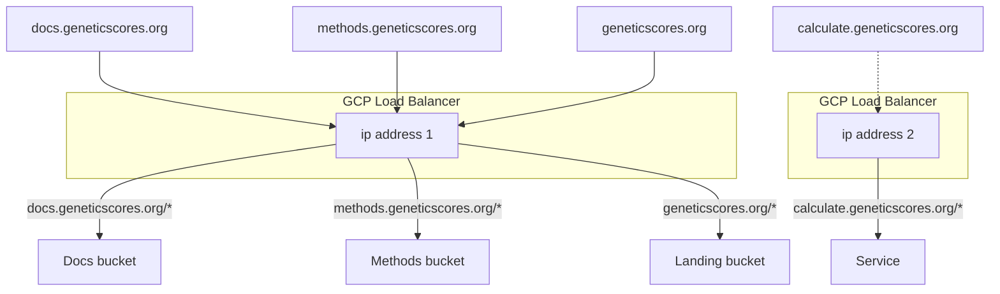

# GeneticScores.org infrastructure

You can use this repository to create Google Cloud Platform infrastructure to run an instance of `GeneticScores.org` with [OpenTofu](https://opentofu.org/) (forked from Terraform).

> [!TIP]
> The main branch of the live repository should be a 1:1 representation of what’s actually deployed in production.

## Setup

```
$ brew update
$ brew install tofu
$ tofu init
$ gcloud auth application-default login
```

## Before you get started

### Set up tofu backend bucket

Make sure a backend bucket exists in the production project, e.g.:

```
gs://genetic-scores-tofu-state
```

Enabling object versioning, soft delete, and encryption is a good idea.

> [!NOTE]
> This bucket will contain the state of your infrastructure in lock files, which helps people to collaborate and reduces the risk of losing state

### Reserve IP addresses

> [!TIP]
> Ignore this section unless you destroyed or released the existing addresses in GCP

* IP addresses aren't managed by the code here because updating DNS records is a manual process (you have to raise a SNOW request).
* Instead, the templates assume that the addresses have been created already:
 
```
$ gcloud compute addresses create static-site-lb-ip --project=${PROJECT_ID} --global
$ gcloud compute addresses create calculation-service-static-ip --project=${PROJECT_ID} --global
```

* These IP addresses are defined in `data.tf` for each environment directory. This means that tofu won't modify them: it has read only access.




## Environment overview

* dev and test create infrastructure for a calculation service instance
* prod creates extra infrastructure to deploy static sites with extra uptime/alerting

 
| Environment | tf script   | Description                                                                    |
|-------------|-------------|--------------------------------------------------------------------------------|
| dev         | 01-gke      | Autopilot cluster, CloudSQL database, VPC                                      |
| dev         | 02-services | Kubernetes resources, IAM, ingress, managed SSL certs (calculation service)    |
| test        | 01-gke      | Autopilot cluster, CloudSQL database, VPC                                      |
| test        | 02-services | Kubernetes resources, IAM, ingress, managed SSL certs (calculation service)    |
| prod        | 01-gke      | Autopilot cluster, CloudSQL database, VPC                                      |
| prod        | 02-services | Kubernetes resources, workload identity federation, ingress                    |
| prod        | 03-sites    | Load balancer, backend bucket, managed SSL certs (static sites), uptime checks |

## Deploying a development environment

> “Begin at the beginning," the King said, very gravely, "and go on till you come to the end: then stop.”
 
Each environment has up to 3 scripts. Begin at the beginning (01-gke):

```
$ cd environments/dev/01-gke
$ tofu plan
```

> [!TIP]
> `plan` will prompt for variables. You can put these variables in a file to save time, e.g.:
>
> ```
> $ tofu plan -var-file="testing.tfvars"
> ```

If everything looks sensible, create the resources by applying the deployment.

```
$ tofu apply
```

Then create the associated services:

```
$ cd environments/dev/02-services
$ tofu apply
```

### Deleting an environment

* You can delete all the created resources by using `tofu destroy`
* On the production environment the database and Kubernetes cluster have deletion prevention enabled, so you'll get an error message until you manually change it in the GCP console
* Some resources like reserved IP addresses are not managed by terraform and won't be deleted 

> [!TIP]
> If you destroy and then apply the terraform plan on the same GCP project you will experience an error that some resources already exist when recreating the services.
> 
> This happens because the workload identity pool and pool provider are only soft deleted by GCP. It takes 30 days for these resources to be hard deleted.
>
> You have to undelete the pool and provider on the GCP console and manually import them into terraform state. 
> 
> ```
> $ tofu destroy -var-file="testing.tfvars" # you've deleted everything in 02-services for some reason, now go and undelete the identity pool and provider in the GCP console
> $ tofu import -var-file="testing.tfvars" module.k8s_services.google_iam_workload_identity_pool.gitlab projects/<PROJECT_ID>/locations/global/workloadIdentityPools/<POOL_NAME>
> $ tofu import -var-file="testing.tfvars" module.k8s_services.google_iam_workload_identity_pool_provider.gitlab-provider projects/<PROJECT_ID>/locations/global/workloadIdentityPools/<POOL_NAME>/providers/<PROVIDER_NAME>
> $ tofu apply -var-file="testing.tfvars" # should be OK now
> ```

## Next steps

Now follow the [deployment checklist](https://www.ebi.ac.uk/seqdb/confluence/display/GDP/Deployment+Steps), including:

- [ ] Initialise the database (try Cloud SQL studio to connect - there's no public IP)
- [ ] Install the DPA in the database
- [ ] Deploy redis
- [ ] Deploy kafka
- [ ] Register the K8S cluster on GitLab and install the runner 
- [ ] Deploy bff gateway
- [ ] Deploy microservices
- [ ] Deploy cronjobs
- [ ] Deploy job submitter
- [ ] Run a test job with HAPNEST
