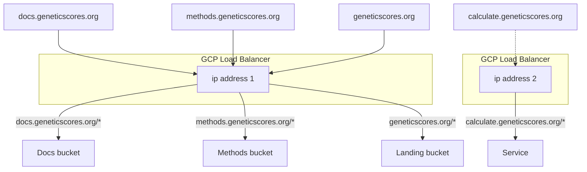

# GeneticScores.org infrastructure

[OpenTofu](https://opentofu.org/) is an open source infrastructure as code tool (forked from Terraform).

You can use this repository to create Google Cloud Platform infrastructure to run an instance of `GeneticScores.org`.

> [!TIP]
> The main branch of the live repository should be a 1:1 representation of what’s actually deployed in production.

## Setup

```
$ brew update
$ brew install tofu
$ tofu init
$ gcloud auth application-default login
```

## Before you get started

### Set up tofu backend bucket

Make sure a backend bucket exists in the production project, e.g.:

```
gs://genetic-scores-tofu-state
```

Enabling object versioning, soft delete, and encryption is a good idea.

> [!NOTE]
> This bucket will contain the state of your infrastructure in lock files, which helps people to collaborate and reduces the risk of losing state

### Reserve IP addresses

IP addresses aren't managed by the code here because updating DNS records is currently a manual process. Instead, the templates assume that the addresses have been created already:

```
$ gcloud compute addresses create static-site-lb-ip --project=${PROJECT_ID} --global
$ gcloud compute addresses create calculation-service-static-ip --project=${PROJECT_ID} --global
```

These IP addresses are defined in `data.tf` for each environment. This means that tofu won't modify them: it has read only access.



## Pick an environment

```
$ cd environments/test
```

## Plan a deployment

```
$ tofu plan
```

> [!TIP]
> `plan` will prompt for variables. You can put these variables in a file to save time, e.g.:
>
> ```
> $ tofu plan -var-file="testing.tfvars"
> ```

If everything looks sensible, create the resources by applying the deployment.

## Execute a deployment

```
$ tofu apply
```
